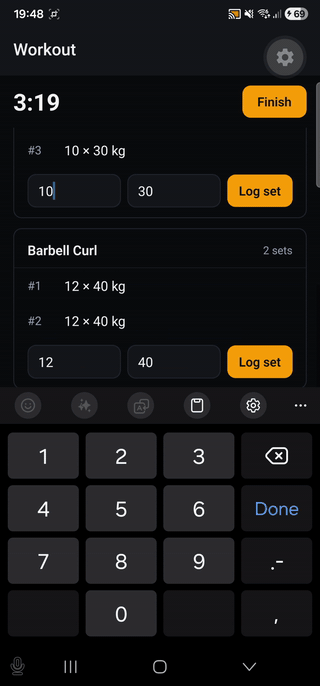
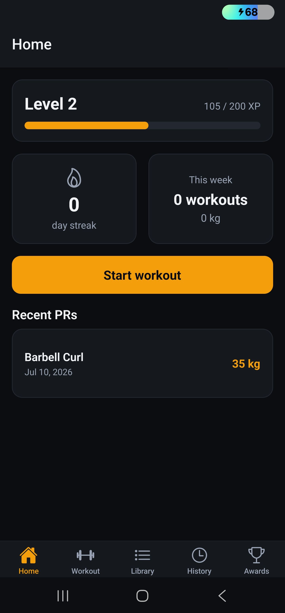
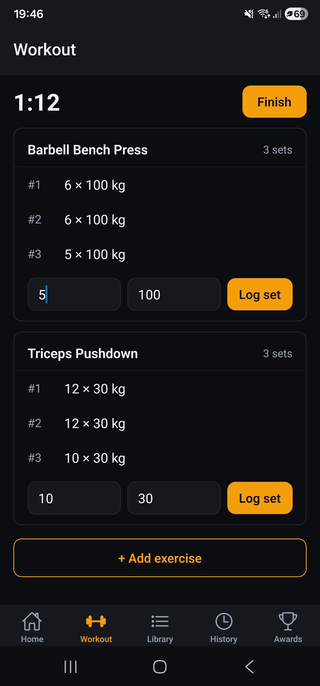
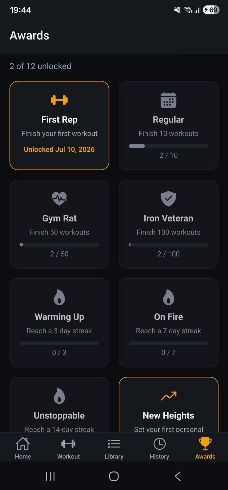
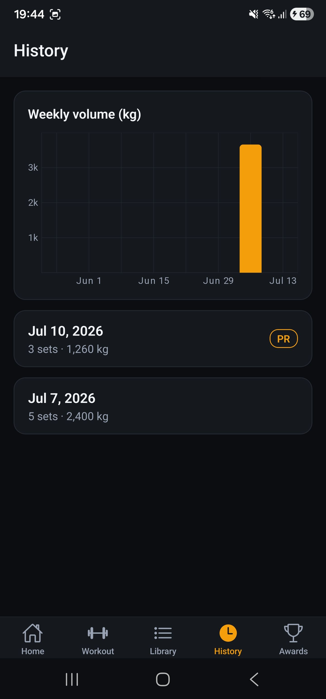
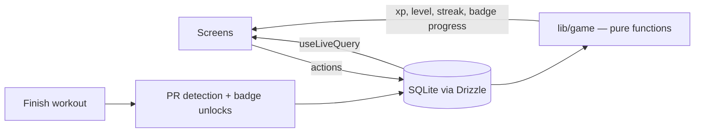

# SetSaga

[](https://github.com/souliN02/setsaga/actions/workflows/ci.yml)

**A gamified, offline-first workout tracker.** Log sets, reps and weight; SetSaga turns consistency into XP, levels, streaks, badges and automatically detected personal records — with every byte of data in SQLite on your device.

<p align="center">
  
</p>

## Features

- **Workout logging** — pick from ~100 seeded exercises (or create your own), log sets × reps × kg with quick-add defaults and swipe-to-delete
- **Gamification** — XP and levels, rest-day-tolerant streaks, 12 badges, automatic PR detection
- **History & charts** — past workouts with full set breakdowns, per-exercise max-weight chart, weekly volume chart
- **Crash-safe** — kill the app mid-workout and lose nothing; the next launch offers Resume or Discard
- **Offline by design** — no account, no network, no analytics. It works in a concrete basement gym.

| Home | Active workout | Achievements | Charts |
|---|---|---|---|
|  |  |  |  |

## Architecture

SQLite is the single source of truth. Screens write through Drizzle and re-render via `useLiveQuery`; all gamification numbers are derived from the database by pure functions.



## Engineering decisions

**Local-first, no backend.** A workout tracker must work with zero signal, and fitness data is personal. All data lives in SQLite on the device — no accounts, no sync, no network layer anywhere in the codebase. This constraint is what makes the rest of the architecture interesting.

**Write-through, crash-safe logging.** Starting a workout immediately inserts the workout row; every set is inserted the moment it's confirmed. "Finish" just stamps `finishedAt` and runs the post-workout pipeline. If the app dies mid-session, launch detects the unfinished row and offers Resume or Discard — nothing is ever held only in memory.

**Gamification state is derived, never stored.** XP, level, streak and badge progress are recomputed from the workout data by pure functions on every read — never incremented in place. Stored state is limited to badge *unlock events* (so "unlocked 12 Mar" and one-time toasts work) and the `isPr` flag on sets (a historical fact about that set). Derived state cannot drift out of sync with the data that produced it.

**Pure-function game engine, built test-first.** `lib/game/` and `lib/dates.ts` contain no React, no DB and no Expo imports. Every rule — the level curve, streak gaps across month/year boundaries, first-set PRs, every badge threshold — was written as a failing test first; the 211-test suite *is* the spec.

**Bundled SQLite migrations.** drizzle-kit generates migrations at dev time; the `.sql` files are inlined into the JS bundle and applied on launch, so the schema evolves safely on users' devices with no server involved.

**kg-internal units.** Weights are stored in kg as `real`; all display formatting goes through one `formatWeight()` helper, so a future lbs toggle is a one-file change.

## Local setup

```sh
pnpm install
pnpm start        # then scan the QR code with Expo Go on your phone
```

Run the checks:

```sh
pnpm test         # jest-expo (game engine, dates, seed, queries helpers)
pnpm lint         # ESLint
pnpm typecheck    # tsc --noEmit
```

Database workflow: schema lives in `lib/db/schema.ts`; after changing it, run `pnpm db:generate` and commit the new migration. Never edit an already-applied migration.

Android APK (EAS free tier): `pnpm dlx eas-cli build -p android --profile preview`

## Roadmap

The MVP is intentionally lean (full spec in [SPEC.md](SPEC.md)). Candidate next features, one at a time:

- Rest timer with notification
- Estimated-1RM PRs (Epley) and rep-PRs at a given weight
- Workout templates ("Push day" one-tap start)
- lbs unit toggle
- wger API import for a larger exercise library
- Apple Health / Google Fit export

---

SetSaga is a portfolio project — built to showcase local-first mobile architecture, not to monetize your bench press. MIT licensed.
