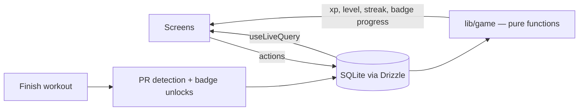

# SPEC.md — SetSaga

*(Name availability checked July 2026: no existing fitness app by this name, and a GitHub repo search returns zero hits.)*

## 1. What this is

A gamified workout tracker for iOS and Android. You log exercises, sets, reps and weight; the app turns consistency into XP, levels, streaks, badges and automatically detected personal records.

**The engineering narrative** (this goes in the README and in interviews): the app is **local-first**. All data lives in SQLite on the device — no accounts, no backend, no network required. A workout tracker must work in a concrete basement gym with zero signal, and fitness data is personal. This constraint drives the real architectural decisions: bundled database migrations, crash-safe write-through logging, and a gamification engine built as pure functions with derived state so XP/streaks/badges can never drift out of sync with the underlying data.

## 2. MVP scope

**In scope:**
- Log a workout: pick exercises from a library, record sets × reps × weight (kg)
- Seeded exercise library (~100 exercises) with search and muscle-group filter, plus user-created custom exercises
- Gamification: XP + levels, day streaks, 12 badges, automatic PR detection
- History: past workouts list, workout detail, per-exercise progress chart, weekly volume chart
- Resume an interrupted workout after an app crash or kill
- Dark mode as the default (it's a gym app)

**Out of scope for MVP (do not build, suggest only):**
- Accounts, sync, cloud anything, social features
- Workout templates / routines / rest timers
- lbs unit toggle (kg only), bodyweight-tracking, cardio/distance exercises
- wger API integration, Apple Health / Google Fit
- Notifications

## 3. Tech stack

| Layer | Choice | Why |
|---|---|---|
| Framework | Expo SDK (latest stable) + React Native + **TypeScript strict** | One codebase, both platforms, test on real hardware via Expo Go |
| Navigation | **Expo Router** (file-based tabs) | Same mental model as Next.js routing |
| Database | **expo-sqlite + Drizzle ORM** | Same ORM as LineDrift; typed queries; offline by nature |
| Migrations | **drizzle-kit**, bundled with the app | Schema evolves safely on users' devices |
| State | **Zustand** (active-session UI state only) | DB is the source of truth; Zustand never stores anything the DB owns |
| Reactivity | Drizzle `useLiveQuery` | Screens re-render when the DB changes, no manual cache invalidation |
| Charts | **Victory Native** (+ react-native-skia, reanimated, gesture-handler) | Performant native charts, Expo-compatible |
| Testing | **jest-expo** | Expo's official preset; the game engine is pure TS so tests are trivial to write |
| CI | **GitHub Actions** | lint + typecheck + tests on every PR |

Everything free. No paid services anywhere.

## 4. Architecture and data flow

- **Local-first:** SQLite is the single source of truth. No network layer exists in the MVP.
- **Write-through logging (crash-safe):** starting a workout immediately inserts a `workouts` row with `finishedAt = null`. Every set is inserted the moment it's confirmed. "Finish workout" just stamps `finishedAt` and runs the post-workout pipeline. If the app dies mid-session, launch detects the unfinished workout and offers *Resume* or *Discard*.
- **Derived gamification state:** XP, level, streak and badge *progress* are computed from the database by pure functions — never incremented in place. Stored gamification state is limited to badge **unlock events** (so we can show "unlocked 12 Mar" and toast exactly once) and the `isPr` flag on sets (a historical fact about that set).
- **Post-workout pipeline** (runs on finish): detect PRs → flag sets → recompute badge criteria → insert new unlock rows → surface toasts (PRs, level-ups, badges).



## 5. Project structure

```
app/
  _layout.tsx              # root layout: theme, DB provider, migrations
  (tabs)/
    _layout.tsx            # tab bar: Home, Workout, Library, History, Awards
    index.tsx              # Home
    workout.tsx            # Start / active workout
    library.tsx            # Exercise library
    history.tsx            # Workout history
    achievements.tsx       # Badges
  workout/[id].tsx         # Past workout detail
  exercise/[id].tsx        # Exercise detail + progress chart
components/                # Reusable UI (SetRow, XpBar, StreakFlame, BadgeCard…)
lib/
  db/
    schema.ts              # Drizzle schema (single source of truth for types)
    client.ts              # expo-sqlite client + Drizzle instance
    seed.ts                # idempotent seeding from data/exercises.json
    queries.ts             # all reads/writes live here — screens never touch SQL
  game/                    # PURE FUNCTIONS ONLY — no React, no DB imports
    xp.ts                  # XP rules, level curve
    streak.ts              # streak logic on date keys
    prs.ts                 # PR detection
    badges.ts              # badge definitions + criteria
  dates.ts                 # toLocalDateKey() and friends
store/
  sessionStore.ts          # Zustand: activeWorkoutId + transient UI state
data/
  exercises.json           # ~100 seed exercises
drizzle/                   # generated migrations (committed)
__tests__/                 # mirrors lib/ structure
```

## 6. Data model

Weights stored in **kg** as `real`. Timestamps as **unix ms** integers. Enums as text with TS union types from `schema.ts`.

```ts
exercises
  id            integer pk autoincrement
  name          text not null unique
  muscleGroup   text not null   // 'chest'|'back'|'legs'|'shoulders'|'arms'|'core'|'full_body'
  equipment     text not null   // 'barbell'|'dumbbell'|'machine'|'cable'|'bodyweight'|'kettlebell'|'other'
  isCustom      integer not null default 0   // boolean

workouts
  id            integer pk autoincrement
  startedAt     integer not null
  finishedAt    integer            // null = in progress
  name          text               // optional, e.g. "Push day"
  notes         text

sets
  id            integer pk autoincrement
  workoutId     integer not null references workouts.id (cascade delete)
  exerciseId    integer not null references exercises.id
  setNumber     integer not null   // 1-based per exercise per workout
  reps          integer not null   // > 0
  weightKg      real not null      // >= 0; 0 = pure bodyweight
  isPr          integer not null default 0
  createdAt     integer not null

achievements
  badgeId       text pk            // matches a badge id from lib/game/badges.ts
  unlockedAt    integer not null
```

Indexes: `sets(workoutId)`, `sets(exerciseId)`, `workouts(finishedAt)`.

**Definitions used everywhere:**
- *Finished workout* = `finishedAt != null` **and** it contains ≥ 1 set. Only finished workouts count for stats, streaks, XP and badges.
- *Set volume* = `weightKg × reps`. *Workout volume* = sum of its set volumes. Bodyweight sets (0 kg) contribute 0 volume by definition.

## 7. Exercise seed data

`data/exercises.json` — an array of `{ name, muscleGroup, equipment }`. **~100 real, common gym exercises**, correctly categorised, no duplicates, no niche circus movements. Rough distribution: legs 25, back 20, chest 15, shoulders 12, arms 15, core 10, full_body 3 (deadlift lives in legs; clean & press etc. in full_body).

Seeding is **idempotent**: on app start, insert-or-ignore by `name`. User-created exercises get `isCustom = 1` and are never touched by seeding.

## 8. Gamification engine — precise definitions

This is the correctness-critical part of the app. Everything below lives in `lib/game/` as pure functions and is **built test-first in Phase 3**. The tests are the spec; if a rule needs changing, change the test first.

### 8.1 XP

| Event | XP |
|---|---|
| Each logged set (in a finished workout) | **10** |
| Each finished workout | **50** |
| Each PR event | **25** |

Total XP is **derived**: `10·sets + 50·workouts + 25·prEvents`, computed from the DB. Never stored, never incremented.

### 8.2 Levels

- `totalXpForLevel(L) = 50 · L · (L − 1)` — cumulative XP required to *reach* level L. Level 1 = 0 XP, level 2 = 100, level 3 = 300, level 4 = 600, level 5 = 1000, level 10 = 4500.
- `levelForXp(xp)` = the largest L with `totalXpForLevel(L) ≤ xp`.
- Progress bar shows XP into the current level over XP needed for the next.
- Pacing check (intentional): a typical 15-set workout ≈ 200 XP → level 2 after the first session, level 5 after ~5 sessions, level 10 after ~20. Early levels feel fast, later ones are earned.

### 8.3 Streaks

Operates on **local date keys** (`YYYY-MM-DD` via `toLocalDateKey`), never raw timestamps.

- A **training day** = a local date with ≥ 1 finished workout.
- Two consecutive training days belong to the same streak if they are **≤ 2 calendar days apart** (i.e. at most one full rest day between them — nobody should lose a streak for taking a rest day).
- **Current streak** = number of training days in the chain containing the most recent training day, but only if `today − lastTrainingDay ≤ 2`; otherwise 0.
- The streak is **at risk** (show it visually) when `today − lastTrainingDay = 2`.

Examples: trained Mon+Tue+Wed → 3. Trained Mon+Wed+Fri → 3. Trained Mon then Thu (two rest days) → streak reset, now 1. Last trained the day before yesterday → streak still alive but at risk until tonight.

### 8.4 Personal records (PRs)

- Weight-based, per exercise. Sets with `weightKg ≤ 0` never qualify.
- On finishing a workout, for each exercise in it: if `max(weightKg in this workout) > max(weightKg in all previously finished workouts for that exercise)`, that's **one PR event** — flag `isPr = 1` on the single heaviest qualifying set.
- The first-ever weighted set for an exercise counts as a PR (your baseline).
- Max **one PR event per exercise per workout**, regardless of how many times you beat yourself within the session.

### 8.5 Badges

Derived from data; a row in `achievements` is written the first time a criterion is met (that's the unlock event + toast). Definitions live in `lib/game/badges.ts` as `{ id, name, description, isUnlocked(stats) }`.

| id | Name | Criterion |
|---|---|---|
| first_workout | First Rep | 1 finished workout |
| workouts_10 | Regular | 10 finished workouts |
| workouts_50 | Gym Rat | 50 finished workouts |
| workouts_100 | Iron Veteran | 100 finished workouts |
| streak_3 | Warming Up | streak reaches 3 |
| streak_7 | On Fire | streak reaches 7 |
| streak_14 | Unstoppable | streak reaches 14 |
| first_pr | New Heights | first PR event |
| pr_10 | Record Breaker | 10 PR events |
| session_volume_5k | Heavy Session | ≥ 5,000 kg volume in a single workout |
| lifetime_volume_100k | Six Figures | ≥ 100,000 kg lifetime volume |
| sets_500 | Set Machine | 500 lifetime sets |

Streak badges unlock when the streak *reaches* the threshold and stay unlocked forever, even after the streak breaks.

## 9. Screens (MVP)

**Home (`(tabs)/index`)** — level + XP progress bar, streak flame with count (+ at-risk state), this week at a glance (workouts, volume), primary *Start workout* button, recent PRs.

**Workout (`(tabs)/workout`)** — no active session: big *Start workout*. Active session: elapsed time, list of exercises added, per-exercise set rows (`setNumber × reps × kg`) with quick add (defaults to previous set's values), swipe to delete, *Add exercise* (opens library as picker), *Finish* → pipeline runs → toasts for PRs / level-up / badges. Unfinished workout on launch → Resume/Discard prompt.

**Library (`(tabs)/library`)** — searchable list, muscle-group filter chips, *Create custom exercise* form (name + group + equipment). Tapping an exercise outside a session → exercise detail.

**History (`(tabs)/history`)** — reverse-chronological workouts (date, name, sets, volume, PR count) → workout detail (`workout/[id]`) with full set breakdown, PRs highlighted.

**Exercise detail (`exercise/[id]`)** — max-weight-over-time line chart, personal best, recent sets.

**Achievements (`(tabs)/achievements`)** — badge grid, locked = greyed with progress toward criterion, unlocked = colored with date.

Every list has a designed empty state (a fresh install should look intentional, not broken).

## 10. Testing

- `lib/game/*` and `lib/dates.ts` are pure functions → unit tested with jest-expo, **written before implementation** in Phase 3. Cover: level curve boundaries, streak gap edge cases (incl. month/year boundaries), PR first-set and same-workout rules, every badge criterion at threshold − 1 / threshold.
- `lib/db/queries.ts` gets integration tests against an in-memory SQLite where practical.
- No UI snapshot testing in MVP — the engine is where correctness matters.
- CI (GitHub Actions): `lint`, `typecheck`, `test` on every push/PR. All three green = mergeable.

## 11. Constraints and non-goals

- **No backend, no accounts, no analytics, no network calls.** If a feature seems to need a server, it's out of scope (see section 14).
- Free tooling only. No paid Expo services; EAS build free tier is fine for the final APK.
- kg only in MVP. All display formatting goes through one `formatWeight()` helper so a unit toggle later is one change.
- No `any` in the codebase. Drizzle schema types flow outward from `lib/db/schema.ts`.

## 12. Build phases

One phase per Claude Code session, on a branch, merged via PR. Each phase ends with CI green.

**Phase 0 — Scaffold**
`create-expo-app` (TS template), Expo Router tab skeleton with 5 placeholder tabs, ESLint + Prettier, jest-expo wired with one passing dummy test, GitHub Actions workflow (lint/typecheck/test), folder structure from section 5, dark theme default.
*Done when: app boots in Expo Go on a physical phone, all 5 tabs navigate, CI is green.*
*Kickoff: "Read SPEC.md and CLAUDE.md. Plan Phase 0 and show me the plan before writing any code."*

**Phase 1 — Database, seed, library**
Drizzle schema (section 6), expo-sqlite client, drizzle-kit migrations bundled and applied on launch, `exercises.json` with ~100 exercises (section 7), idempotent seeding, Library screen with search + filter + custom exercise creation, all reads via `queries.ts` + `useLiveQuery`.
*Done when: a fresh install shows ~100 searchable, filterable exercises and a custom exercise survives an app restart.*
*Kickoff: "Phase 1 per SPEC.md sections 5–7. Plan first, including the drizzle-kit + expo migration setup."*

**Phase 2 — Workout logging**
Session store, start workout (write-through row), add exercises, log/edit/delete sets, finish workout, resume/discard unfinished workout on launch. No gamification yet.
*Done when: I can log a full real workout at the gym, kill the app mid-session, resume, finish — and it's all still there after a restart.*
*Kickoff: "Phase 2 per SPEC.md sections 4 and 9 (Workout screen). Plan first; pay attention to the crash-recovery flow."*

**Phase 3 — Gamification engine (TDD)**
`lib/game/` + `lib/dates.ts`: XP, levels, streaks, PRs, badges exactly per section 8. **Tests written first**, then implementations. Post-workout pipeline wired into finish (data layer only — UI comes next phase).
*Done when: every rule in section 8 has a test, coverage on lib/game is ≥ 90%, and finishing a workout writes isPr flags and achievement rows correctly.*
*Kickoff: "Phase 3. Write the full jest test suite for SPEC.md section 8 first, show it to me, then implement until green."*

**Phase 4 — Gamification UI**
Home screen (XP bar, level, streak flame, weekly stats), Achievements grid with locked/unlocked states and progress, finish-workout celebration toasts (PR / level-up / badge).
*Done when: beating my bench max on the phone triggers a PR toast and the XP bar visibly moves.*
*Kickoff: "Phase 4 per SPEC.md section 9 (Home + Achievements). Plan first."*

**Phase 5 — History and charts**
History list, workout detail, exercise detail with Victory Native charts (max weight over time, weekly volume on Home or History).
*Done when: charts render correctly from real logged data, including with only 1–2 data points.*
*Kickoff: "Phase 5 per SPEC.md section 9 (History + Exercise detail). Plan the chart data queries first."*

**Phase 6 — Polish and presentation**
Empty states everywhere, haptics on set-complete/PR/level-up, app icon + splash, README per section 13 with screenshots and a screen-recording GIF, EAS build of an installable APK, repo description + topics, MIT license.
*Done when: you'd send the repo link and the GIF to a hiring manager.*
*Kickoff: "Phase 6 per SPEC.md sections 12–13. Start with a gap list against the spec, then plan."*

## 13. README checklist

- One-line pitch + GIF of logging a set and hitting a PR at the very top + CI badge
- Features list (short), screenshots (Home, active workout, achievements, charts)
- Architecture diagram (mermaid, section 4)
- **"Engineering decisions" section** — local-first rationale, write-through crash-safe logging, derived-not-stored gamification state (and why that prevents drift), bundled SQLite migrations on-device, pure-function game engine built TDD, kg-internal units
- Local setup (clone, install, `npx expo start`, scan QR) + how to run tests
- Roadmap (section 14) + note that the app is a portfolio project

## 14. v2 ideas (after MVP ships, pick ONE)

- Rest timer with notification
- Estimated-1RM PRs (Epley: `weight × (1 + reps/30)`) and rep-PRs at a given weight
- Workout templates / routines ("Push day" one-tap start)
- lbs toggle
- wger API import for a bigger exercise library with instructions/images
- Apple Health / Google Fit export
